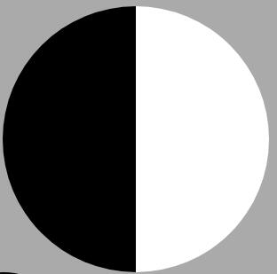
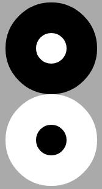

# 案例1：太极阴阳鱼
+ ## 太极图
  
 *太极图案（阴阳鱼）考察知识点：*
		html基本标签div
		css基本属性：宽度、高度、边框、圆角、定位

 *基本思路：*
		1.div，单独设置左右边框，使其成为半黑半白矩形
			width:0;
			heigt:300px;
			border-left:150px solid #fff;
			border-right:150px solid #000;
		2.矩形->圆形：
			border-radius:100%;

		3.两个div，设置两个小的同心圆（内黑外白，内白外黑）
			同心圆的方法有多种：边框，阴影（内阴影，外阴影），叠加（大圆叠小圆）
		4.设置同心圆偏移至合适位置即可。

		
**源码：**
```
	<!DOCTYPE html>
	<html>
		<head>
			<meta charset="utf-8">
			<title></title>
			<style type="text/css">
				body{
					background: #aaa;
				}
				#taiji{
					width: 0;
					height: 300px;
					border-left: 150px solid #000;
					border-right: 150px solid #fff;
					border-radius: 100%;
				}
				.tj{
					width: 50px;
					height: 50px;
					border-radius: 100%;
				}
				#tj1{
					transform: translate(-25px,50px);
					background: #000000;
					box-shadow: 0 0 0 50px #fff ;
				}
				#tj2{
					transform: translate(-25px,150px);
					background: #fff;
					box-shadow: 0 0 0 50px #000;
				}
			</style>
		</head>
		<body>
			<div id="taiji">
				<div id="tj1" class="tj"></div>
				<div id="tj2" class="tj"></div>
				
			</div>
		</body>
	</html>

```